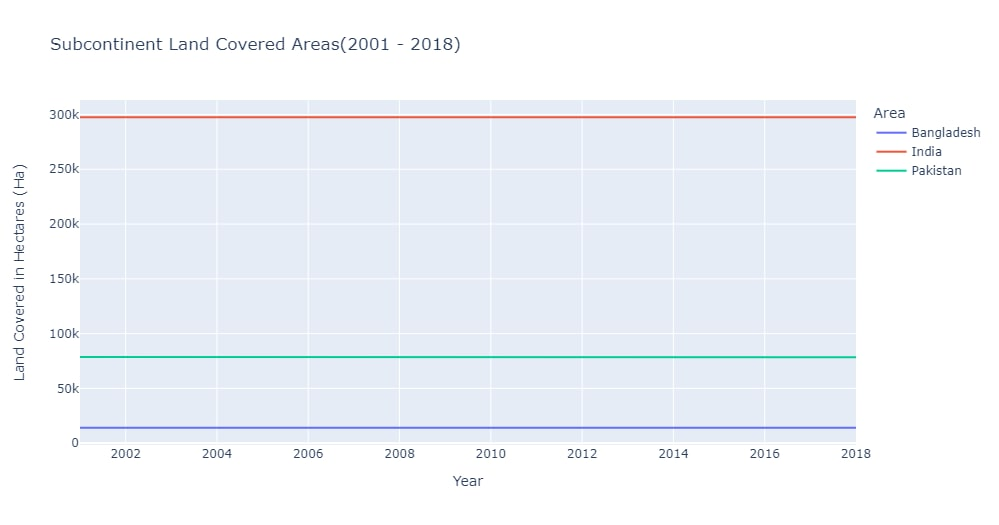

# **Team Enterpeneurs:**
### EDA Analysis of HPZ-competition-Land Cover Data


# Abstract:
>- This Land cover data set is based on Data Source gathered from https://www.fao.org/faostat/en/#data/LC.
> 
>- Data of 244 Countries was selected.
> 
**Description of Columns:**
> 
| Column Name     | Column Description   | 
| :-------------- | :------------------- |
  |  Domain         |  Land Cover          |
  |Area      | the country name | 
  |Element|MODIS land cover types based on the Land Cover Classification System|
  |Item|Artificial surfaces (including urban and associated areas)', 'Herbaceous crops', 'Woody crops', 'Multiple or layered crops', 'Grassland', 'Tree-covered areas', 'Mangroves', 'Shrub-covered areas', 'Shrubs and/or herbaceous vegetation, aquatic or regularly flooded', 'Sparsely natural vegetated areas', 'Terrestrial barren land', 'Permanent snow and glaciers', 'Inland water bodies', 'Coastal water bodies and intertidal areas'|
  |Year|2001 to 2018|
  |Unit| 1000 ha|
  |Value|Hactres of covered land|
  |Flag Description|"Calculated Data", "Data not available" and "Aggregate, may include official, semi-official, estimated or calculated data"|
 
**Methodolgy:**
 >First of all whole data was explored. Redundent Data was removed to simplify the analysis. There were 28% Missing values in Values columns.Distribution of data is right skewed due to:
 i.e Land Cover is different in variou countries oand largely depend on the Area of Country.
 We Divide our EDA into two parts.
- Part 1 is EDA on whole data
- Part 2 is EDA on Subcontinent Countries only
  


# **Part 1:EDA on whole dataset**
## Step 1: Import Necessary Libraries

```python
import numpy as np
import pandas as pd
import seaborn as sns
import matplotlib.pyplot as plt
import seaborn as sns
import matplotlib.ticker as ticker
```
## Step 2: Import the Data

```python
# Open file
df=pd.read_csv('land_cover_data_11-30-2021.csv')
df.head()
```

<table border="1" class="dataframe">
  <thead>
    <tr style="text-align: right;">
      <th></th>
      <th>Domain Code</th>
      <th>Domain</th>
      <th>Area Code (ISO3)</th>
      <th>Area</th>
      <th>Element Code</th>
      <th>Element</th>
      <th>Item Code</th>
      <th>Item</th>
      <th>Year Code</th>
      <th>Year</th>
      <th>Unit</th>
      <th>Value</th>
      <th>Flag</th>
      <th>Flag Description</th>
    </tr>
  </thead>
  <tbody>
    <tr>
      <th>0</th>
      <td>LC</td>
      <td>Land Cover</td>
      <td>AFG</td>
      <td>Afghanistan</td>
      <td>5007</td>
      <td>Area from MODIS</td>
      <td>6970</td>
      <td>Artificial surfaces (including urban and assoc...</td>
      <td>2001</td>
      <td>2001</td>
      <td>1000 ha</td>
      <td>88.1603</td>
      <td>FC</td>
      <td>Calculated data</td>
    </tr>
    <tr>
      <th>1</th>
      <td>LC</td>
      <td>Land Cover</td>
      <td>AFG</td>
      <td>Afghanistan</td>
      <td>5007</td>
      <td>Area from MODIS</td>
      <td>6970</td>
      <td>Artificial surfaces (including urban and assoc...</td>
      <td>2002</td>
      <td>2002</td>
      <td>1000 ha</td>
      <td>88.1818</td>
      <td>FC</td>
      <td>Calculated data</td>
    </tr>
    <tr>
      <th>2</th>
      <td>LC</td>
      <td>Land Cover</td>
      <td>AFG</td>
      <td>Afghanistan</td>
      <td>5007</td>
      <td>Area from MODIS</td>
      <td>6970</td>
      <td>Artificial surfaces (including urban and assoc...</td>
      <td>2003</td>
      <td>2003</td>
      <td>1000 ha</td>
      <td>88.2247</td>
      <td>FC</td>
      <td>Calculated data</td>
    </tr>
    <tr>
      <th>3</th>
      <td>LC</td>
      <td>Land Cover</td>
      <td>AFG</td>
      <td>Afghanistan</td>
      <td>5007</td>
      <td>Area from MODIS</td>
      <td>6970</td>
      <td>Artificial surfaces (including urban and assoc...</td>
      <td>2004</td>
      <td>2004</td>
      <td>1000 ha</td>
      <td>88.2462</td>
      <td>FC</td>
      <td>Calculated data</td>
    </tr>
    <tr>
      <th>4</th>
      <td>LC</td>
      <td>Land Cover</td>
      <td>AFG</td>
      <td>Afghanistan</td>
      <td>5007</td>
      <td>Area from MODIS</td>
      <td>6970</td>
      <td>Artificial surfaces (including urban and assoc...</td>
      <td>2005</td>
      <td>2005</td>
      <td>1000 ha</td>
      <td>88.3106</td>
      <td>FC</td>
      <td>Calculated data</td>
    </tr>
  </tbody>
</table>
</div>


## Step 3: View The Data Structure

```python
rows,columns=df.shape
print("number of columns: ",columns)    
print("number of rows: ",rows)
```

    number of columns:  14
    number of rows:  60760
    


```python
df.info()
```

    <class 'pandas.core.frame.DataFrame'>
    RangeIndex: 60760 entries, 0 to 60759
    Data columns (total 14 columns):
     #   Column            Non-Null Count  Dtype  
    ---  ------            --------------  -----  
     0   Domain Code       60760 non-null  object 
     1   Domain            60760 non-null  object 
     2   Area Code (ISO3)  60760 non-null  object 
     3   Area              60760 non-null  object 
     4   Element Code      60760 non-null  int64  
     5   Element           60760 non-null  object 
     6   Item Code         60760 non-null  int64  
     7   Item              60760 non-null  object 
     8   Year Code         60760 non-null  int64  
     9   Year              60760 non-null  int64  
     10  Unit              60760 non-null  object 
     11  Value             43400 non-null  float64
     12  Flag              60760 non-null  object 
     13  Flag Description  60760 non-null  object 
    dtypes: float64(1), int64(4), object(9)
    memory usage: 6.5+ MB
    
```python
#get unique values count for each column
c=list(df.columns.values)
for i in c:
  print( i,":", df[ i ].nunique())

```
    Domain Code : 1
    Domain : 1
    Area Code (ISO3) : 244
    Area : 244
    Element Code : 1
    Element : 1
    Item Code : 14
    Item : 14
    Year Code : 18
    Year : 18
    Unit : 1
    Value : 18961
    Flag : 2
    Flag Description : 2
    continent : 7
    

## Step 4: Find the Null Values


```python
#check missing values
df.isnull().sum()
```


    Domain Code             0
    Domain                  0
    Area Code (ISO3)        0
    Area                    0
    Element Code            0
    Element                 0
    Item Code               0
    Item                    0
    Year Code               0
    Year                    0
    Unit                    0
    Value               17360
    Flag                    0
    Flag Description        0
    dtype: int64


```python
#percentage of missing values
df.isnull().sum()/df.shape[0]*100
```


    Domain Code          0.000000
    Domain               0.000000
    Area Code (ISO3)     0.000000
    Area                 0.000000
    Element Code         0.000000
    Element              0.000000
    Item Code            0.000000
    Item                 0.000000
    Year Code            0.000000
    Year                 0.000000
    Unit                 0.000000
    Value               28.571429
    Flag                 0.000000
    Flag Description     0.000000
    dtype: float64


> **Result interpreted**
> - No Column has missing values except Value column
>   
> - Missing values in Value column account for 28%
> 
> - Now we are going to remove na values

## Step 5: Handling the missing data


```python
df = df[df["Flag Description"] != "Data not available"]
df.info()
```

    <class 'pandas.core.frame.DataFrame'>
    Int64Index: 43472 entries, 0 to 60741
    Data columns (total 14 columns):
     #   Column            Non-Null Count  Dtype  
    ---  ------            --------------  -----  
     0   Domain Code       43472 non-null  object 
     1   Domain            43472 non-null  object 
     2   Area Code (ISO3)  43472 non-null  object 
     3   Area              43472 non-null  object 
     4   Element Code      43472 non-null  int64  
     5   Element           43472 non-null  object 
     6   Item Code         43472 non-null  int64  
     7   Item              43472 non-null  object 
     8   Year Code         43472 non-null  int64  
     9   Year              43472 non-null  int64  
     10  Unit              43472 non-null  object 
     11  Value             43400 non-null  float64
     12  Flag              43472 non-null  object 
     13  Flag Description  43472 non-null  object 
    dtypes: float64(1), int64(4), object(9)
    memory usage: 5.0+ MB
    


```python
df["Value"] = df.groupby('Area')['Value'].transform(lambda x: x.fillna(x.mean()))
```


```python
#percentage of missing values
df.isnull().sum()/df.shape[0]*100
```


    Domain Code         0.0
    Domain              0.0
    Area Code (ISO3)    0.0
    Area                0.0
    Element Code        0.0
    Element             0.0
    Item Code           0.0
    Item                0.0
    Year Code           0.0
    Year                0.0
    Unit                0.0
    Value               0.0
    Flag                0.0
    Flag Description    0.0
    dtype: float64


> **Result interpreted**
> - No Column has missing values Now
>   

## Step 6: Features Engineering
> We are going to do following steps for feature engineering
> - Create a ssperate column for Continent
> - Create seperate dataframes for each item and each continent


```python
#Adding a new column of Continent 
import pycountry_convert as pc
def country_to_continent(country_name):
    country_alpha2 = pc.country_name_to_country_alpha2(country_name)
    country_continent_code = pc.country_alpha2_to_continent_code(country_alpha2)
    country_continent_name = pc.convert_continent_code_to_continent_name(country_continent_code)
    return country_continent_name

continent=[]
for i in df['Area']:
    
   if i=='Chagos Archipelago':
       continent.append('Africa')
       
   elif i=='Western Sahara':
       continent.append('Africa')
   elif i=='Channel Islands'  :
       continent.append('Europe')
   elif i=='China, Hong Kong SAR'  :
       continent.append('Asia')
   elif i=='China, Macao SAR'  :
       continent.append('Asia')
   elif i=='China, mainland'  :
       continent.append('Asia')
   elif i=='China, Taiwan Province of'  :
       continent.append('Asia')
   elif i=='French Guyana'  :
       continent.append('South America')
   elif i=='French Southern Territories'  :
       continent.append('Antarctica')
   elif i=='Heard and McDonald Islands'  :
       continent.append('Antarctica')
   elif i=='Holy See'  :
       continent.append('Europe')
   elif i=='Iran (Islamic Republic of)'  :
       continent.append('Europe')
   elif i=='Johnston Island'  :
       continent.append('Oceania')
   elif i=='Micronesia (Federated States of)'  :
       continent.append('Oceania')
   elif i=='Midway Island'  :
       continent.append('North America')
   elif i=='Netherlands Antilles (former)'  :
       continent.append('Europe')
   elif i=='Pitcairn'  :
       continent.append('Oceania')
   elif i=='Wake Island'  :
       continent.append('Oceania')
   elif i=='Wallis and Futuna Islands'  :
       continent.append('Oceania')
   elif i=='Republic of Korea'  :
       continent.append('Asia')
   elif i=='Serbia and Montenegro'  :
       continent.append('Europe')
   elif i=='Sudan (former)'  :
       continent.append('Asia')
   elif i=='Timor-Leste'  :
       continent.append('Asia')
   elif i=='Venezuela (Bolivarian Republic of)'  :
       continent.append('South America')
   elif i=='Antarctica' :
       continent.append('Antarctica')
   elif i=='Bolivia (Plurinational State of)' :
       continent.append('South America')
   else:
      continent.append(country_to_continent(i))

df["continent"]=continent
```

```python
#create a new data frame with selected columns
# Domain code,Domain,element code,element, unit are left because have only 1 value
df=df[['Area Code (ISO3)','Area','Item Code','Item','Year','Value','continent']]
```


```python
df['continent'].value_counts()
```


    Africa           10420
    Asia              9342
    Europe            8950
    North America     6660
    Oceania           4860
    South America     2700
    Antarctica         540
    Name: continent, dtype: int64


```python
#Create dataframe based on continents
df_a=df.loc[df['continent']=='Asia']
df_e=df.loc[df['continent']=='Europe']
df_an=df.loc[df['continent']=='Antarctica']
df_aus=df.loc[df['continent']=='Australia']
df_o=df.loc[df['continent']=='Oceania']
df_s=df.loc[df['continent']=='South America']
df_an=df.loc[df['continent']=='North America']
```


```python
df['Item'].value_counts()
```


    Artificial surfaces (including urban and associated areas)           4340
    Herbaceous crops                                                     4340
    Grassland                                                            4340
    Tree-covered areas                                                   4340
    Mangroves                                                            4340
    Shrub-covered areas                                                  4340
    Shrubs and/or herbaceous vegetation, aquatic or regularly flooded    4340
    Terrestrial barren land                                              4340
    Permanent snow and glaciers                                          4340
    Inland water bodies                                                  4340
    Woody crops                                                            18
    Multiple or layered crops                                              18
    Sparsely natural vegetated areas                                       18
    Coastal water bodies and intertidal areas                              18
    Name: Item, dtype: int64


```python
#create dataframebased on item
Artif=df.loc[df['Item']== 'Artificial surfaces (including urban and associated areas)' ]
Grass=df.loc[df['Item']== 'Grassland']
Tree=df.loc[df['Item']== 'Tree-covered areas']
shrub=df.loc[df['Item']== 'Shrub-covered areas']
flooded=df.loc[df['Item']== 'Shrubs and/or herbaceous vegetation, aquatic or regularly flooded']
terrestrial=df.loc[df['Item']== 'Terrestrial barren land']
snow=df.loc[df['Item']== 'Permanent snow and glaciers']
inland=df.loc[df['Item']== 'Inland water bodies']
```

## Step 7: Outlier Detection

```python
sns.boxplot(df["Value"])

```


```python
df.head()
```


<div>
<style scoped>
    .dataframe tbody tr th:only-of-type {
        vertical-align: middle;
    }

    .dataframe tbody tr th {
        vertical-align: top;
    }

    .dataframe thead th {
        text-align: right;
    }
</style>
<table border="1" class="dataframe">
  <thead>
    <tr style="text-align: right;">
      <th></th>
      <th>Domain Code</th>
      <th>Domain</th>
      <th>Area Code (ISO3)</th>
      <th>Area</th>
      <th>Element Code</th>
      <th>Element</th>
      <th>Item Code</th>
      <th>Item</th>
      <th>Year Code</th>
      <th>Year</th>
      <th>Unit</th>
      <th>Value</th>
      <th>Flag</th>
      <th>Flag Description</th>
      <th>continent</th>
    </tr>
  </thead>
  <tbody>
    <tr>
      <th>0</th>
      <td>LC</td>
      <td>Land Cover</td>
      <td>AFG</td>
      <td>Afghanistan</td>
      <td>5007</td>
      <td>Area from MODIS</td>
      <td>6970</td>
      <td>Artificial surfaces (including urban and assoc...</td>
      <td>2001</td>
      <td>2001</td>
      <td>1000 ha</td>
      <td>88.1603</td>
      <td>FC</td>
      <td>Calculated data</td>
      <td>Asia</td>
    </tr>
    <tr>
      <th>1</th>
      <td>LC</td>
      <td>Land Cover</td>
      <td>AFG</td>
      <td>Afghanistan</td>
      <td>5007</td>
      <td>Area from MODIS</td>
      <td>6970</td>
      <td>Artificial surfaces (including urban and assoc...</td>
      <td>2002</td>
      <td>2002</td>
      <td>1000 ha</td>
      <td>88.1818</td>
      <td>FC</td>
      <td>Calculated data</td>
      <td>Asia</td>
    </tr>
    <tr>
      <th>2</th>
      <td>LC</td>
      <td>Land Cover</td>
      <td>AFG</td>
      <td>Afghanistan</td>
      <td>5007</td>
      <td>Area from MODIS</td>
      <td>6970</td>
      <td>Artificial surfaces (including urban and assoc...</td>
      <td>2003</td>
      <td>2003</td>
      <td>1000 ha</td>
      <td>88.2247</td>
      <td>FC</td>
      <td>Calculated data</td>
      <td>Asia</td>
    </tr>
    <tr>
      <th>3</th>
      <td>LC</td>
      <td>Land Cover</td>
      <td>AFG</td>
      <td>Afghanistan</td>
      <td>5007</td>
      <td>Area from MODIS</td>
      <td>6970</td>
      <td>Artificial surfaces (including urban and assoc...</td>
      <td>2004</td>
      <td>2004</td>
      <td>1000 ha</td>
      <td>88.2462</td>
      <td>FC</td>
      <td>Calculated data</td>
      <td>Asia</td>
    </tr>
    <tr>
      <th>4</th>
      <td>LC</td>
      <td>Land Cover</td>
      <td>AFG</td>
      <td>Afghanistan</td>
      <td>5007</td>
      <td>Area from MODIS</td>
      <td>6970</td>
      <td>Artificial surfaces (including urban and assoc...</td>
      <td>2005</td>
      <td>2005</td>
      <td>1000 ha</td>
      <td>88.3106</td>
      <td>FC</td>
      <td>Calculated data</td>
      <td>Asia</td>
    </tr>
  </tbody>
</table>
</div>


## Step 8: Checking the Normalization


```python
sns.distplot(df_selected["Value"])
```


    

    
### **Interpretation**
> Data is right skewed for every type of Land Cover

## Step-9 Data Visualization

#### **Visualization of World land coverage over the years(2001-2018)**
```pyhton
# Visualization of World land coverage over the years(2001-2018)

import plotly.express as px
fig = px.line(df1, x="Year",
              y="Value",
              labels={
                     "Value" : "Land Covered in Hectares (Ha)"
                 },
              color='Area',
              title='World Land Covered Areas')
fig.show()
```


The World Land Coverage plot shows the land coverage of world countries over the years. Over the years there is not much significant change in the land coverage. The world top land covered territories are Russian Federation, China, Antarctica, Canada,China, mainland.

#### **Land Coverage on a World Map**
```pyhton
# Create the layout of the chart
title = '<b>World Land Covered Areas</b>'
layout2 = go.Layout(title = {'text' : title, 
                            'x':0.5, 'xanchor': 'center'}, 
                   font = {"color" : 'black'},
                   width=980, height=600, plot_bgcolor="white", paper_bgcolor="white",
                   geo=dict(showframe=False, showcoastlines=False, projection_type='equirectangular'
                           )
                  )

# Create the figure
fig2 = go.Figure(layout = layout2)


# Create the Choropleth map tracing
trace2 = go.Choropleth(
    locations = df1['Area Code (ISO3)'],
    z = df1['Value'],
    text = df1['Area'],
    colorscale = 'Viridis',
    #color_continuous_scale="RdYlGn",
    autocolorscale=False,
    reversescale=True,
    marker_line_color='#2E2E2E',
    marker_line_width=0.5,
    colorbar_tickprefix = '%',
    colorbar_title = 'Landcover',
)

fig2.add_trace(trace2)
fig2.show()
```

The world map shows the land coverage of the countries. The color bar shows the land coverage in hectares. The regions with purple color being the top land covered and the regions with the yellowish color being the least land covered.

#### **Top 10 Countries in world with maximum Tree covered Area**

```pyhton
s=Tree.groupby(["Area"]).sum().sort_values(by="Value", ascending=False).head(10)
plt.figure(figsize=(5,3), dpi=150, linewidth=2)
pl=sns.barplot(x='Value',y=s.index,data=s).set(title='Top 10 Countries in World with maximum Tree covered Area')
plt.xlabel("Land Covered in Hectares (Ha)")
```

Out of the top world countries Russian Federation have maximum land covered by Trees.


#### **Top 5 countries in world with snow and glaciers**

```pyhton
s=snow.groupby(["Area"]).sum().sort_values(by="Value", ascending=False).head(5)
plt.figure(figsize=(5,3), dpi=150, linewidth=2)
pl=sns.barplot(x='Value',y=s.index,data=s).set(title='Top 5 Countries in World with most snow and glaciers')
plt.xlabel("Land Covered in Hectares (Ha)")
```

Out of the world top five countries/regions, Antarctica have maximum land covered by Snow and Glaciers.


#### **Tree Covered Areas of Top Land Covered Countries (2001 - 2018)**

```pyhton
fig = px.line(landcover, x="Year", y="Value",color='Area', 
                            labels={
                     "Value" : "Land Covered in Hectares (Ha)"
                 },
              title='Tree Covered Areas of Top Land Covered Countries (2001 - 2018')
fig.show()
```


## Part-2: EDA on Subcontinent
Land Coverage from Subcontinent
In this section subcontinent countries will be examined. the list of countries are as follows:

* Bangladesh,
* India,
* Pakistan

### Feature Selection and Data Insights
```
# Selecting Subcontinents countries
df_selected = df_land[df_land["Area"].isin(["India", "Pakistan", "Bangladesh"])]
df_selected.head()
```


```
# Shape of selected subcontinents countries dataframe
df_selected.shape
```
> **OutPut:**
```
(540, 6)
```

```
# Summary Statistics of selected subcontinents countries dataframe
df_selected.describe()
```
> **OutPut:**


#### Selecting the important features and combining them based on Land Coverage Value

```pyhton
dfsouth = df_selected.groupby(["Area", "Area Code (ISO3)", "Year"])["Value"].sum().reset_index()
dfsouth.head()
```


#### Checking the different Land Types in  the Subcontient

```python
df_selected["Item"].unique()
```
The different land types are:<br>
array(['Artificial surfaces (including urban and associated areas)',
       'Herbaceous crops', 'Grassland', 'Tree-covered areas', 'Mangroves',
       'Shrub-covered areas',
       'Shrubs and/or herbaceous vegetation, aquatic or regularly flooded',
       'Terrestrial barren land', 'Permanent snow and glaciers',
       'Inland water bodies'], dtype=object)

### **Visualizing Subcontinents Countries Land Coverage and Percent Changes Over the Time**

#### Subcontinent Countries Land Coverage over the years

```python
fig = px.line(dfsouth, x="Year", y="Value",
              labels={
                     "Value" : "Land Covered in Hectares (Ha)"
                 },
              color='Area', title='South Asia Land Covered Areas(2001 - 2018)')
fig.show()
```


#### Land Coverage by Subcontinent Countries (Combine)

```python
dfsouth[dfsouth["Year"] == 2018].groupby('Area').Value.sum().plot(kind='bar')
plt.ylabel("Land Covered in Hectares (Ha)")
```


### **Study the Percent Change in the Forest Land in Subcontinent**

```python
# === Covered Forest Land ===

# Filter only tree-covered areas & Group
landcover = df_selected[df_selected["Item"] == "Tree-covered areas"]
landcover = landcover.groupby(["Area Code (ISO3)","Area","Year"])["Value"].sum().reset_index()

# Select only the base year (2001) and reference year (2018)
# and compute the percent change between them
landcover = landcover[(landcover["Year"] == 2001) | (landcover["Year"] == 2018)].reset_index()
landcover = landcover.pivot(index=["Area Code (ISO3)","Area"], columns = "Year", values="Value").reset_index()
landcover["%change"] = ((landcover[2018] - landcover[2001])/ landcover[2001])*100

landcover.head()
```


#### Visualizing the Percent Change in a Map for clear Understanding

```python

# Create the layout of the chart
title = '<b>Tree-Covered %Change in South Asia</b><br><sup>2018 vs 2001</sup>'
layout1 = go.Layout(title = {'text' : title, 
                            'x':0.5, 'xanchor': 'center'}, 
                   font = {"color" : 'black'},
                   width=980, height=600, plot_bgcolor="white", paper_bgcolor="white",
                   geo=dict(showframe=False, showcoastlines=False, projection_type='equirectangular'
                           )
                  )

# Create the figure
fig1 = go.Figure(layout = layout1)

# Create the Choropleth map tracing
trace1 = go.Choropleth(
    locations = landcover['Area Code (ISO3)'],
    z = landcover['%change'],
    text = landcover['Area'],
    colorscale = 'RdYlGn',
    autocolorscale=False,
    reversescale=False,
    marker_line_color='#2E2E2E',
    marker_line_width=0.5,
    colorbar_tickprefix = '%',
    colorbar_title = '%change',
)

fig1.add_trace(trace1)

fig1.show()
```


### **Study the Percent Change in the Grass Land in Subcontinent**

```python
# === Covered Grass Land ===

# Filter only tree-covered areas & Group
landcover = df_selected[df_selected["Item"] == "Grassland"]
landcover = landcover.groupby(["Area Code (ISO3)","Area","Year"])["Value"].sum().reset_index()

# Select only the base year (2001) and reference year (2018)
# and compute the percent change between them
landcover = landcover[(landcover["Year"] == 2001) | (landcover["Year"] == 2018)].reset_index()
landcover = landcover.pivot(index=["Area Code (ISO3)","Area"], columns = "Year", values="Value").reset_index()
landcover["%change"] = ((landcover[2018] - landcover[2001])/ landcover[2001])*100

landcover.head()
```


#### Visualizing the Percent Change in a Map for clear Understanding

```python

# Create the layout of the chart
title = '<b>Grass Land %Change in Sub Continent</b><br><sup>2018 vs 2001</sup>'
layout1 = go.Layout(title = {'text' : title, 
                            'x':0.5, 'xanchor': 'center'}, 
                   font = {"color" : 'black'},
                   width=980, height=600, plot_bgcolor="white", paper_bgcolor="white",
                   geo=dict(showframe=False, showcoastlines=False, projection_type='equirectangular'
                           )
                  )

# Create the figure
fig1 = go.Figure(layout = layout1)

# Create the Choropleth map tracing
trace1 = go.Choropleth(
    locations = landcover['Area Code (ISO3)'],
    z = landcover['%change'],
    text = landcover['Area'],
    colorscale = 'RdYlGn',
    autocolorscale=False,
    reversescale=False,
    marker_line_color='#2E2E2E',
    marker_line_width=0.5,
    colorbar_tickprefix = '%',
    colorbar_title = '%change',
)

fig1.add_trace(trace1)

fig1.show()
```


## Conclusion
> This has been an extensive examination of the global Land   Coverage over 18 years period. Globally, Russian Federation, China are among the countries with most land covered. In Land Coverage, Russian Federation, Brazil, Canada have the most forest land which are vital to life on Earth. Land Snow and Glaciers, which helps to reduce water scarcity are particularly in majority in Antarctica, Greenland, Canada.<br>
In subcontinent (India, Pakistan, Bangladesh) there is a change in Forest land and grassland. As compared to 2001, India have 3.55%, Pakistan have 39.06% increase in forest land on the other hand Bangladesh have 8.38% decrease in forest land in 2018. When it comes to grass covered land as compared to 2001, India have 18.42%, Pakistan have 10.42% descrease in 2018 on the other hand Bangladesh have 39.45% increase in 2018.<br>
Bangladesh should have to take measure to increase the number of forests because they are vital to life on earth and have positive impact on the environment.